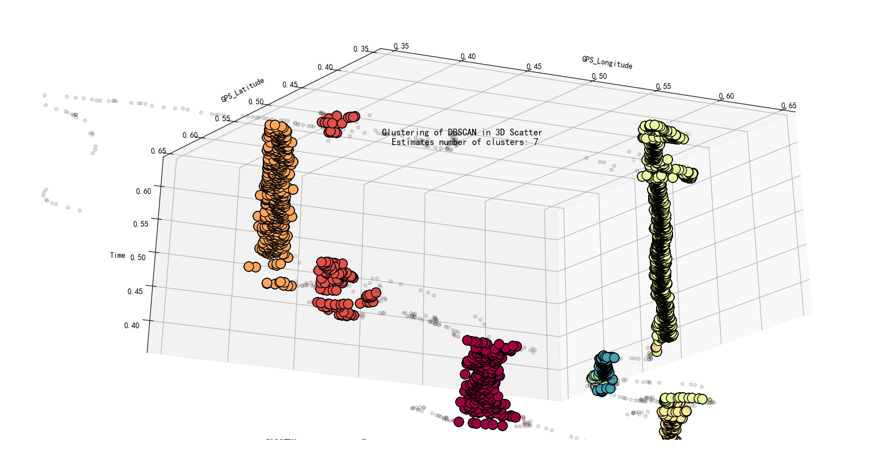
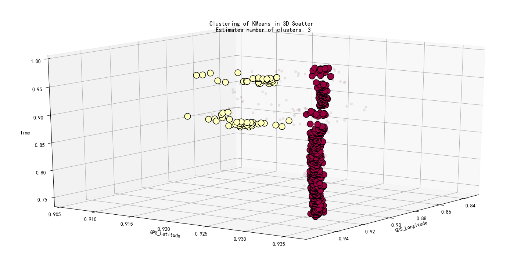

# ClusteringAlgorithm
consist of data preprocessing and visualization
# Cluster3D
Drawn a three-dimensional scatters of a person in space and time and cluster them into several categories.

Help to analyze the behavior characteristics of people in different places and time.

The code is tested against Python 3.6.

